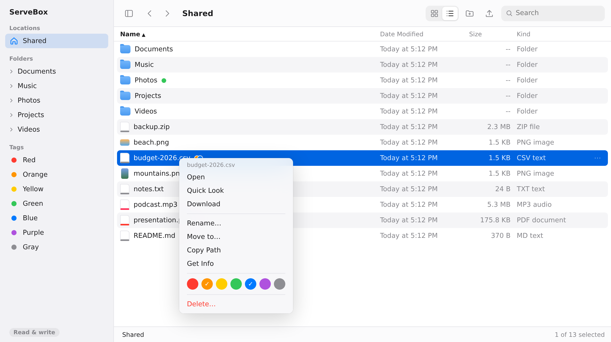
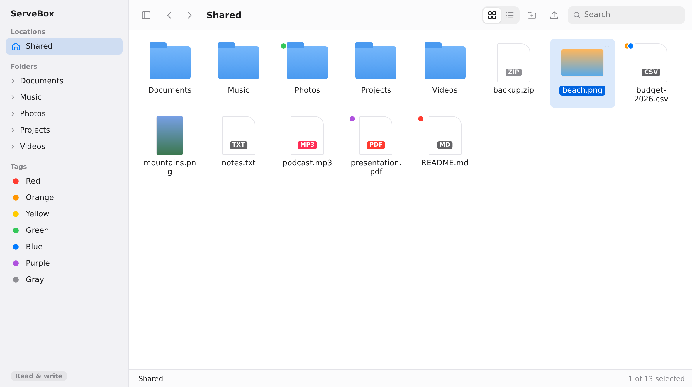
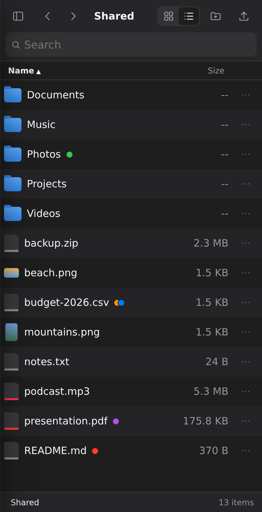

<p align="center"></p>

<h1 align="center">ServeBox</h1>

ServeBox is a local/private file browser and file server for a selected root directory. Think `python -m http.server 9999`, but with a macOS Finder-style web UI: icon and list views, right-click menus, color tags, Quick Look, drag-and-drop moves and uploads, search, and a layout that works on phones.

ServeBox treats the directory you choose at startup as `/` in the browser. It uses one central safe path resolver for UI routes, file routes, and API routes so requests cannot escape that root through absolute paths, `..` traversal, or symlinks that point outside the root.



<p>
  
  
</p>

## Quick Start

Use Python 3.11 or newer.

```bash
python -m venv .venv
source .venv/bin/activate
pip install -r requirements.txt
python -m servebox ~/ --port 9999
```

If your system command is `python3`, use:

```bash
python3 -m venv .venv
source .venv/bin/activate
pip install -r requirements.txt
python3 -m servebox ~/ --port 9999
```

Open the printed URL in your browser.

## Common Examples

Serve your home directory locally:

```bash
python -m servebox ~/ --port 9999
```

Serve Downloads on localhost:

```bash
python -m servebox ~/Downloads --host 127.0.0.1 --port 9999
```

Serve Downloads to your LAN with token auth:

```bash
python -m servebox ~/Downloads --host 0.0.0.0 --port 9999 --token mysecret
```

Run in readonly mode:

```bash
python -m servebox ~/Downloads --readonly
```

Show hidden files:

```bash
python -m servebox ~/Downloads --show-hidden
```

## Documentation

- [Usage Guide](docs/usage.md): install, run commands, all flags, UI behavior, examples, and troubleshooting.

## Features

**Browsing**

- Finder-style window: sidebar (root, lazy folder tree, tags), toolbar, path bar, and item count.
- Icon view with image thumbnails, or list view with sortable Name, Date Modified, Size, and Kind columns.
- Typing in the search box instantly filters the current folder. Press Enter (or **Search all subfolders**) to search the open folder and everything below it; that search runs off the main thread and stops after 10 seconds with partial results.
- Quick Look (Space) for text, images, PDF, audio, and video, plus a full preview page with file info.
- Dark mode follows the system; on phones the sidebar slides in and actions live behind a `⋯` button.

**Managing files** (disabled with `--readonly`)

- Right-click menus: Open, Quick Look, Download, Rename, Move to, Copy Path, Get Info, Tags, Delete.
- Multi-select with Cmd/Ctrl-click and Shift-click.
- Drag items onto a folder, sidebar folder, or path bar segment to move them.
- Drag files in from your desktop to upload, with a progress bar. Name clashes become `file (1).txt`.
- Finder color tags (red, orange, yellow, green, blue, purple, gray). Click a tag in the sidebar to see everything with it. Tags are stored in `.servebox-tags.json` in the served root and follow renames, moves, and deletes.

**Keyboard**

```txt
Arrow keys          Move selection (Shift extends it)
Space               Quick Look
Enter, Cmd/Ctrl+O   Open
Cmd/Ctrl+Up         Parent folder
F2                  Rename
Delete, Cmd+Backsp  Delete selection
Cmd/Ctrl+A          Select all
Cmd/Ctrl+F          Search
Esc                 Close / clear selection
```

**API**

JSON endpoints under `/api/` for list, tree, search, upload, mkdir, rename, move, tags, and delete. File bytes are served from `/raw` (inline) and `/download`.

## CLI Options

```txt
root                         Directory exposed as /
--host                       Bind host, default 127.0.0.1
--port                       Bind port, default 9999
--token                      Require token login and token query access
--readonly                   Disable upload, mkdir, rename, move, delete, and tagging
--show-hidden                Show dotfiles and dot directories
--max-upload-mb              Max upload size per file, default 512
--max-preview-mb             Max text preview size, default 5
--max-search-results         Max recursive search results, default 500
--exclude                    Comma-separated directory names skipped by search
--allow-no-token-on-lan      Permit 0.0.0.0 without a token
```

The default search excludes:

```txt
.git,node_modules,__pycache__,venv,.venv,dist,build,target,.idea,.vscode
```

## Security Notes

ServeBox is designed for local/private use. It is not a public internet file manager.

Binding to `0.0.0.0` exposes ServeBox to your LAN. ServeBox refuses to bind to `0.0.0.0` without `--token` unless you explicitly pass `--allow-no-token-on-lan`.

When `--token` is set, ServeBox accepts either a login through `/login` or a `?token=...` query parameter. The login cookie is HTTP-only and holds an HMAC derived from the token, not the token itself. Failed logins are slowed down.

Other protections:

- Every path goes through one resolver that blocks absolute paths, `..` escapes, and symlinks pointing outside the root.
- Rename, move, and delete act on a symlink itself, never its target; uploads never write through an existing symlink.
- Files from `/raw` are served with `Content-Security-Policy: sandbox`, so an uploaded HTML or SVG file can't run script against ServeBox.
- Pages send a strict CSP and `nosniff`, frame, and referrer headers.
- State-changing requests from another origin are rejected. If you run behind a reverse proxy, keep the original `Host` header.

## Development

Run tests:

```bash
pytest
```

If dependencies are not installed:

```bash
pip install -r requirements.txt
pytest
```

Run a local development instance:

```bash
python -m servebox . --port 9999 --show-hidden
```

## License

ServeBox is licensed under the [MIT License](LICENSE).
